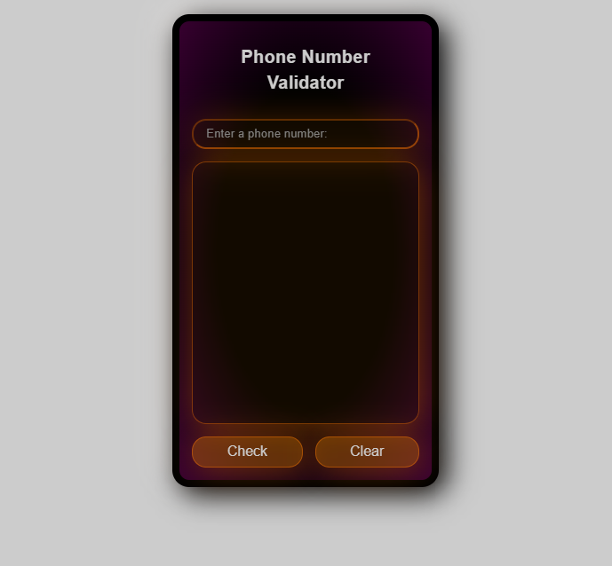

# Validador de numero de telefone

## Descrição

App criado para uma aulo do curso Javascrpt Algorithms and Data Structures do freeCodeCamp.

## Uso

### Instalação

Sem necessidade de instalação. Depois de baixar o projeto, basta abrir o arquivo index.html da pasta raiz.

## Construído com

## Autor

[Mayko Costa](https://github.com/Maykopr)

## Licensa

This project is licensed under the MIT licence
